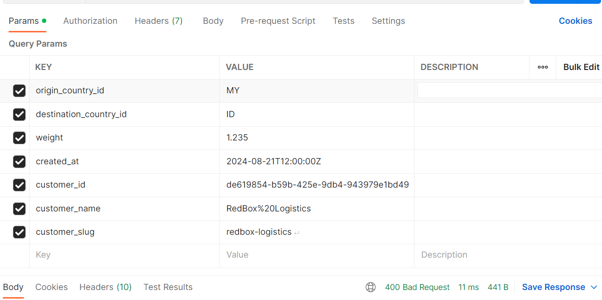

# Unique Tracking Number API

## Overview

This project provides a RESTful API in Django REST Framework for generating unique tracking numbers for parcels. The API validates and processes requests containing parameters such as origin country, destination country, weight, creation timestamp, customer details, and generates a unique tracking number.

## Table of Contents

1. [Prerequisites](#prerequisites)
2. [Setup](#setup)
3. [Database Setup](#database-setup)
4. [Running the Project](#running-the-project)
5. [Testing with Postman](#testing-with-postman)
6. [API Endpoints](#api-endpoints)

## Prerequisites

Before setting up the project, ensure you have the following installed:

* Python 3.x
* pip (Python package installer)
* MySQL
* Git

## Setup

1. **Clone the Repository**

   ```
   git clone https://github.com/UtileHomme/ValueLabs_Assignment.git
   cd local_Folder
   ```
2. **Create and Activate a Virtual Environment**

   ```
   python -m venv venv  
   use venv\Scripts\activate (Windows)
   ```
3. **Install Dependencies (requirements.txt file in github repository)**

   ```
   pip install -r requirements.txt
   ```
4. **Configure Django Settings**

   * Rename `settings.py.example` to `settings.py`.
   * Update the `DATABASES` setting in `settings.py` with your MySQL database credentials.

   ```
   DATABASES = {
   'default': {
   'ENGINE': 'django.db.backends.mysql',
   'NAME': 'MYSQL_database_name',
   'USER': 'MYSQL_database_user',
   'PASSWORD': 'MYSQL_database_password',
   'HOST': 'localhost',
   'PORT': '3306',
   }
   }
   ```

## Database Setup

1. **Restore MySQL Database (database backup .sql file in github repository)**
   * Import the MySQL database backup provided in the repository or import the sql file in MySQL Workbench from your local folder after cloning the project:
   * ```
     mysql -u your_database_user -p your_database_name < path/to/your_backup.sql
     ```
2. **Apply Migrations**
   Run the following command to apply Django migrations:
   ```
   python manage.py migrate
   ```

## Running the Project

1. **Start the Django Development Server**

   ```
   python manage.py runserver
   ```

   The API will be available at `http://127.0.0.1:8000/`.

## Testing with Postman

1. **Import Postman Collection**
   * Open Postman.
   * Go to `File` > `Import` and import the **Valuelabs_Assignment.postman_collection.json file** from the repository into Postman
2. **Run API Requests**
   * Use the imported Postman collection to test the API endpoints.

## API Endpoints

### `GET api/next-tracking-number/`

**Query Parameters:**

* `origin_country_id` (string, ISO 3166-1 alpha-2)
* `destination_country_id` (string, ISO 3166-1 alpha-2)
* `weight` (float, positive number with up to three decimal places)
* `created_at` (string, RFC 3339 timestamp)
* `customer_id` (string, UUID)
* `customer_name` (string, alphabetic characters and spaces only)
* `customer_slug` (string, slug-case/kebab-case)

**Test URL:**

```
http://127.0.0.1:8000/api/next-tracking-number/?origin_country_id=MY&destination_country_id=ID&weight=1.235&created_at=2024-08-21T12:00:00Z&customer_id=de619854-b59b-425e-9db4-943979e1bd49&customer_name=RedBox%20Logistics&customer_slug=redbox-logistics
```

**Request (Example):**



**Response:**

```
{
    "tracking_number": "AGYUKF3OM0C9SR4T",
    "created_at": "2024-08-21T11:30:35.354740+00:00",
    "success": true
}
```
